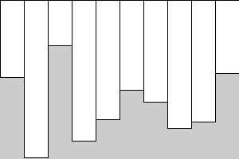
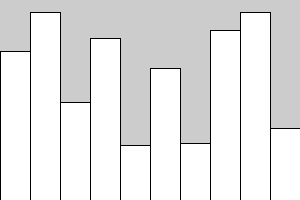

# ClassWork 04 For NeXT CS
### Class Period:
### Name0: YOUR NAME HERE
### Name1: OTHER NAME HERE
### Name2: OTHER NAME HERE (delete this line if you are a duo)
---

In this repository you will find a processing program called barGraph.pde. It includes new processing features we have not yet discussed. Your mission is to join your TableBuddy™ and understand the code by filling out this document, reading the questions and filling in the prompts when asked.

### Task 0
* Read the entire program (do not run it yet), make note of anything you have not seen or used before in class.
* Copy and paste any line of code containing a new method, vairable, or langauge feature below. (you may have seen these outside of class if you've done extra research into processing, if that is the case, still include them here).

YOUR ANSWERS HERE (delte this line once youve added answers)

---

### Task 1

Use the code and information provided here to answer the following questions.

1. Values stored in an array are called _elements_. The position of an element in an array is called on _index_. The first index of any array is `0`. On line 6, the array `values` is initialized. What is the value of the last index of `values`
   * `Answer:        `

2. How can you determine the size of an array? Hint: You can find this in 2 spots in the code.
   * `Answer:        `

3. What syntax would you use to refer to the element at index 4 in `values`?
   * `Answer:        `

4. What does the `randomArray` method do?
   * Answer:

---

### Task 2

Fill in the `drawBars` method. It should go through the array and draw a bar graph based on the values in the array. The height of each bar should be equal to the value of the given element in the array. The width of each bar should be euqal to the `barWidth` parameter. It should look like this (bar heights will be different based on randomness):

If you have this working, try inverting the graph so all the bars start at the bottom like this:

---

### Task 3

Write a new method: `int arrayMax(int[] data)`. This method should _return_ the _index_ of the largest value in `data`. Modify `drawBars` so that the fill color of the bar for the largest value is different from the otehr bars.
